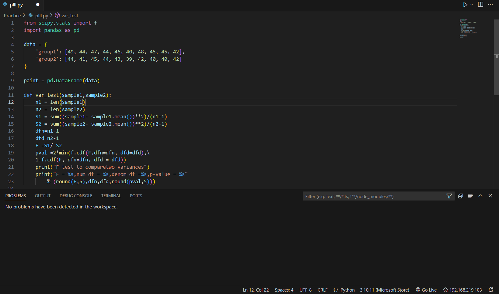
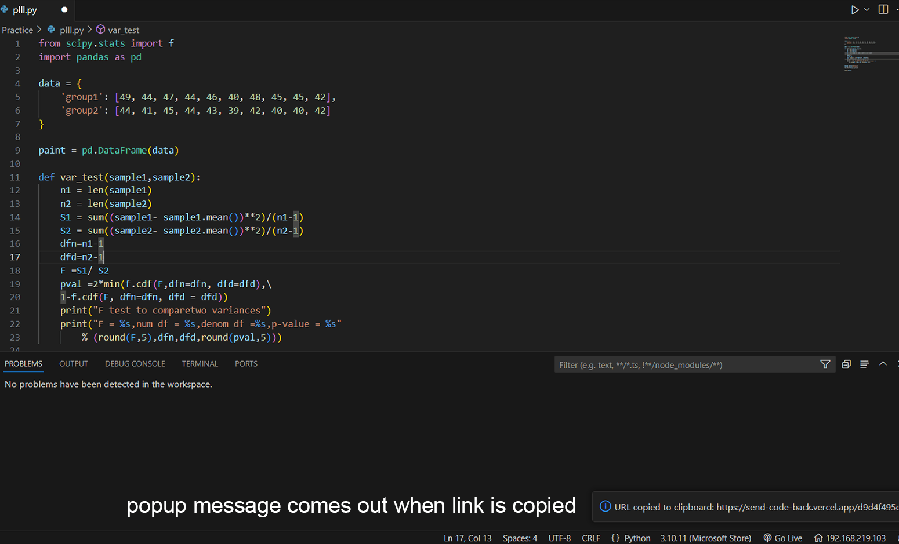
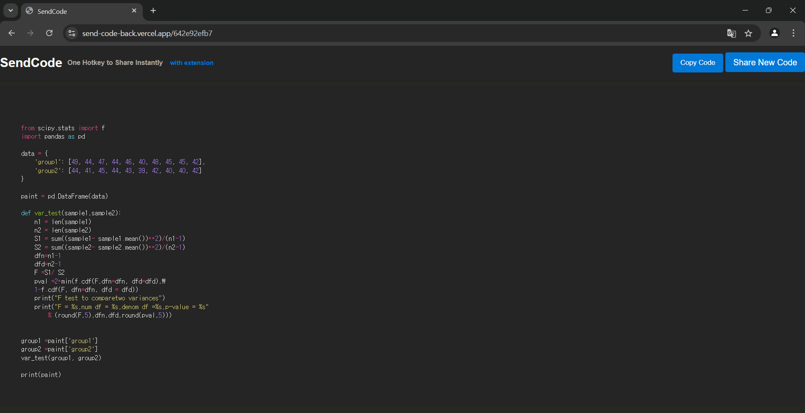

## Strengthen your Ctrl+c!
Now you can share your code with less typing and improved readability by using this extension and its integrated webpage.

## Usage
1. Open a file in Visual Studio Code.
2. Press the key combination `Ctrl+Alt+C` while the cursor is on the file.
-> The link to a web page highlighting the code in the currently opened file will be copied to your clipboard.

## Features
- **Code Highlighting:** Automatically creates a web page highlighting the code from the currently opened file in Visual Studio Code.
- **Clipboard Integration:** Copies the generated web page's link directly to the clipboard for easy sharing.

## Configuration
- **Keyboard Shortcut:** The default shortcut is `Ctrl+Alt+C`.

## License
This extension is licensed under the MIT License.

## Contact
For questions or support, please contact:
- **GitHub Issues:** (https://github.com/pypypypy5/sendcode_vsc_extension)

---
Thank you for using our extension!

